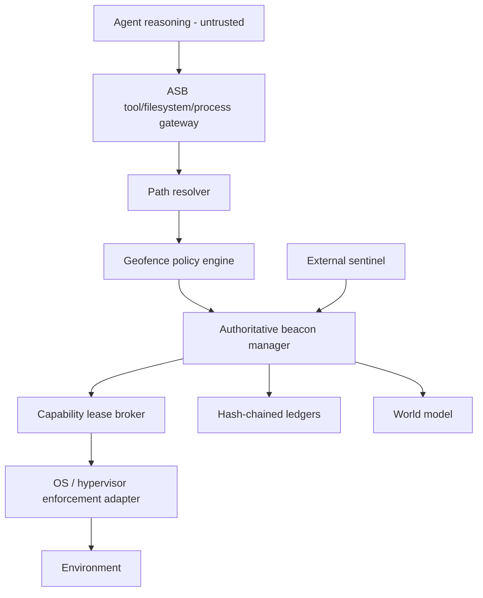

# Architecture

## Trust boundary

The strongest deployment places B, C, L, S, and preferably O outside the agent-writable environment.

## Security position

The reference release implements the filesystem coordinate and generic capability broker. The intended production security position is multidimensional:

- filesystem zone
- process/cgroup zone
- network/egress zone
- credential zone
- tool zone
- data zone

Every privileged capability is a revocable lease derived from the current authoritative security position.
